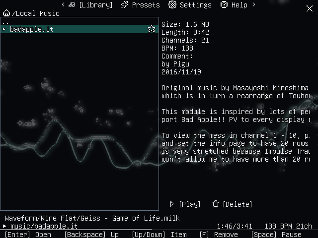

# GlitchScope

**Bring MilkDrop visuals back to your music.**

[Website](https://dendec.github.io/glitchscope/) ·
[Downloads](https://github.com/dendec/glitchscope/releases)

GlitchScope is an open-source music player for Linux and Windows desktops and
low-power PortMaster handhelds. Play a local library, classic tracker and chip
music, or internet radio with real-time MilkDrop-compatible visuals powered by
projectM 4.



## What you can do

- **Watch your music.** Browse MilkDrop presets, preview them before switching,
  and set automatic rotation. Graphics options include adaptive resolution and
  frame-rate limits for slower devices.
- **Play more than standard audio.** FFmpeg handles common formats such as MP3,
  FLAC, WAV, Ogg Vorbis, Opus, and AAC. Tracker and chip support includes MOD,
  XM, IT, S3M, PT3, VTX, YM, SID, and console music formats.
- **Explore music online.** Browse Modland and ModArchive catalogs or find
  stations through Radio Browser. Save tracks to three favorites playlists;
  local music and cached downloads remain available offline.
- **Use the controls that suit your device.** The interface supports gamepads,
  keyboards, mice, and touch. It includes 64 color themes and 15 UI languages.
- **Listen without the visualizer.** Turn visualization off to save power while
  keeping audio playback and library controls available.

Radio plays MP3/AAC streams and basic unencrypted HLS. See the
[radio compatibility notes](docs/RADIO-STREAMING.md) for unsupported HLS
features and other limits.

## Data and asset sources

- Optional MilkDrop preset collections are available in **Presets**:
  [Cream of the Crop](https://www.patreon.com/file?h=91682111&i=16310421),
  [Isosceles Mashups 2020](https://www.patreon.com/file?h=91682111&i=16310422),
  [Isosceles Mashups 2024](https://www.patreon.com/file?h=115453098&m=375145864),
  [En D](https://github.com/projectM-visualizer/presets-en-d),
  [MilkDrop Original](https://github.com/projectM-visualizer/presets-milkdrop-original),
  [projectM Classic](https://github.com/projectM-visualizer/presets-projectm-classic),
  [Butterchurn](https://github.com/jberg/butterchurn-presets),
  and [MilkDrop2077](https://github.com/milkdrop2077/milkdrop2077).
  Downloads are optional, initiated by the user, and stored as ZIP files under
  `presets/`; the app reads presets in-place and extracts only the textures
  needed by projectM. The Presets page can test an installed collection for
  performance, excluding presets below the 20 FPS minimum and recording a
  suitable resolution for the current session. These collections are not
  bundled with GlitchScope. For the projectM and Butterchurn repository collections,
  installation also downloads the [MilkDrop texture pack](https://github.com/projectM-visualizer/presets-milkdrop-texture-pack)
  and combines the ZIPs into the managed archive; no manual extraction is needed.
  Butterchurn retains only `presets/milkdrop/` from its repository ZIP. After
  the source download, the collection shows Installing while textures and the
  managed archive are prepared.
  MilkDrop2077 downloads `PRESETS.RES`, converts its 300 text resources to `.milk`
  entries without modification, and adds the same texture pack to its ZIP.
- Tracker and chip music catalogs: [Modland](https://modland.com/) (the build
  uses its [`allmods.zip` listing](https://modland.antarctica.no/allmods.zip))
  and [The Mod Archive](https://modarchive.org/) (the app browses the
  [module mirror](http://modarchive.textfiles.com/)).
- Internet radio directory: [Radio Browser](https://www.radio-browser.info/).

Preset authors retain their rights. The Isosceles author has authorized
GlitchScope to offer direct downloads of the three Patreon collections.
The projectM collections and their textures are downloaded from the projectM
repositories; upstream README and license notices are retained in the installed
ZIP under `Sources/`. Butterchurn also retains upstream notices there. MilkDrop2077 retains a source and license link in the same
directory. Downloads do not change the assets' terms or make them
part of the GPL application. See the
[release checklist](docs/PORTMASTER-RELEASE.md) for packaging constraints.

## Build and run

### Linux desktop (AMD64)

Requirements: Git with submodule support, Docker, Make, Python 3, and an internet
connection for the first build. Docker builds the native audio and graphics
dependencies; packaging downloads online catalog data. Select a collection in
Presets to download it on demand.

```sh
git clone --recurse-submodules https://github.com/dendec/glitchscope.git
cd glitchscope
make dist
```

The package is created in `dist/linux-amd64/`. Put music in the `music/`
directory beside the executable and launch `./dist/linux-amd64/glitchscope`,
or start with one track:

```sh
./dist/linux-amd64/glitchscope -file /path/to/track.flac
```

### Other release packages

```sh
make dist-windows    # Windows AMD64 package
make dist-portmaster # PortMaster ARM64 zip and submission directory
make release-archives VERSION=1.1 # Versioned archives for all supported targets
```

`make release-archives` builds Linux AMD64, Linux ARM64, Windows AMD64, and
PortMaster packages, then writes versioned assets to `dist/releases/`. Linux
archives use `.tar.gz`; Windows and PortMaster use `.zip`. The Linux ARM64
archive is a regular Linux package with its own launcher; the PortMaster ZIP is
prepared separately by the PortMaster packager. `SHA256SUMS` contains checksums
for all four release archives. Desktop archives include the collected
third-party licenses and omit local music, settings, favorites, and the local
track cache.

For PortMaster packaging, device checks, and asset redistribution notes, see
[the release checklist](docs/PORTMASTER-RELEASE.md).

## Runtime requirements

The release archives bundle the application and its native decoders, but Linux
still needs the system graphics, audio, and C runtime libraries listed below.
The Linux AMD64 package also uses system Vorbis and mpg123 libraries; Linux
ARM64 and PortMaster bundle their codec and C++ runtime libraries. You do not
need to install the `ffmpeg` command-line tool.

### Linux AMD64

Requires x86-64 Linux, glibc 2.35 or newer, a C++ runtime providing
`GLIBCXX_3.4.30`, SDL2, desktop OpenGL, ALSA, Vorbis, mpg123, and zlib. Debian 12
(Bookworm) provides a compatible runtime. Install the dependencies with:

```sh
sudo apt update
sudo apt install \
  libsdl2-2.0-0 libgl1 \
  libvorbisfile3 libvorbis0a libmpg123-0 \
  zlib1g libstdc++6 libasound2
```

The `libstdc++` symbol requirement matters in addition to the glibc version:
an older C++ runtime can prevent startup even when glibc is new enough.
On Debian 13 (Trixie), use `libmpg123-0t64` and `libasound2t64` in place of
`libmpg123-0` and `libasound2`.

### Linux ARM64

Requires 64-bit ARM Linux, glibc 2.36 or newer, SDL2, OpenGL ES 2, ALSA, and
working system audio and graphics drivers. The archive includes its codec and
C++ runtime libraries. On Debian 12 or 64-bit Raspberry Pi OS Bookworm, install
the system dependencies with:

```sh
sudo apt update
sudo apt install libsdl2-2.0-0 libgles2 libasound2
```

On Debian 13 (Trixie), use `libasound2t64` in place of `libasound2`. Other
distributions may use different package names; install the packages that
provide SDL2, GLESv2, and ALSA. Extract the archive and start
`./run-glitchscope.sh`.

### PortMaster

Install the PortMaster ZIP through PortMaster on compatible 64-bit ARM custom
firmware. The firmware must provide glibc 2.36 or newer, SDL2, OpenGL ES 2,
ALSA, and working device graphics and audio drivers. Codec and C++ runtime
libraries are included in the package. Firmware versions differ, so check the
requirements for your device and CFW; the archive contains
`runtime-requirements.txt` for detailed ELF requirements.

### Windows AMD64

Requires 64-bit Windows and a graphics driver that supports desktop OpenGL.
`SDL2.dll` is included beside `glitchscope.exe`; no separate SDL2 installation
is needed. OpenGL and audio system libraries are supplied by Windows and its
device drivers.

### Development checks

```sh
make lint
make test
```

Both commands run in the Docker builder so they use the project's native
dependencies. More commands and repository conventions are in [AGENTS.md](AGENTS.md).

## Controls and settings

Press **Start** on a handheld or **Tab** on a keyboard to open the menu. The
footer shows the controls available on the current screen; the Help page covers
playback and navigation. **Ctrl+F** toggles borderless fullscreen on desktop.

Settings and favorites are saved as `settings.json` and `favorites.json`. When
`XDG_DATA_HOME` is set, the files are stored there; otherwise they are written
to the current working directory.

## Documentation

- [Project documentation index](docs/README.md)
- [Architecture and ownership](docs/ARCHITECTURE.md)
- [PortMaster release checklist](docs/PORTMASTER-RELEASE.md)
- [Seeking and tracker playback design](docs/SEEK-DESIGN.md)

## License

GlitchScope is licensed under the GNU GPL, version 2 or later; see [LICENSE](LICENSE).
Third-party component notices are in
[portmaster/licenses/THIRD_PARTY_LICENSES.md](portmaster/licenses/THIRD_PARTY_LICENSES.md).
